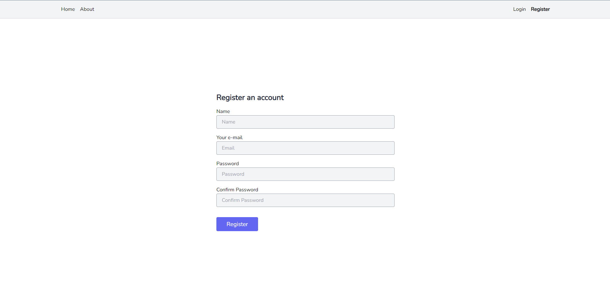

# The similar example of authentication system with vue js(spa) and laravel

### Screenshots of project

# Technologies used:

-   Laravel
-   Mysql
-   Vue.js
-   Tailwind css
-   Swagger

## Steps for install and using this project:

1. clone the project
2. run `composer install` in root directory
3. create `.env` file and copy everything's of `.env.example` file and paste in `.env`
4. create your database and call in `.env` file
5. run `php artisan key:generate` for generate app key
6. run `php artisan migrate` to create tables in your database
7. run `php artisan serve` and open [http://127.0.0.1:8000/](http://127.0.0.1:8000/) in your browser to see the view

---

**_Notice_**

if you don't see anything run `npm install && npm run dev` and reload page

for using api documentation open [http://127.0.0.1:8000/api/documentation](http://127.0.0.1:8000/api/documentation) in your browser
